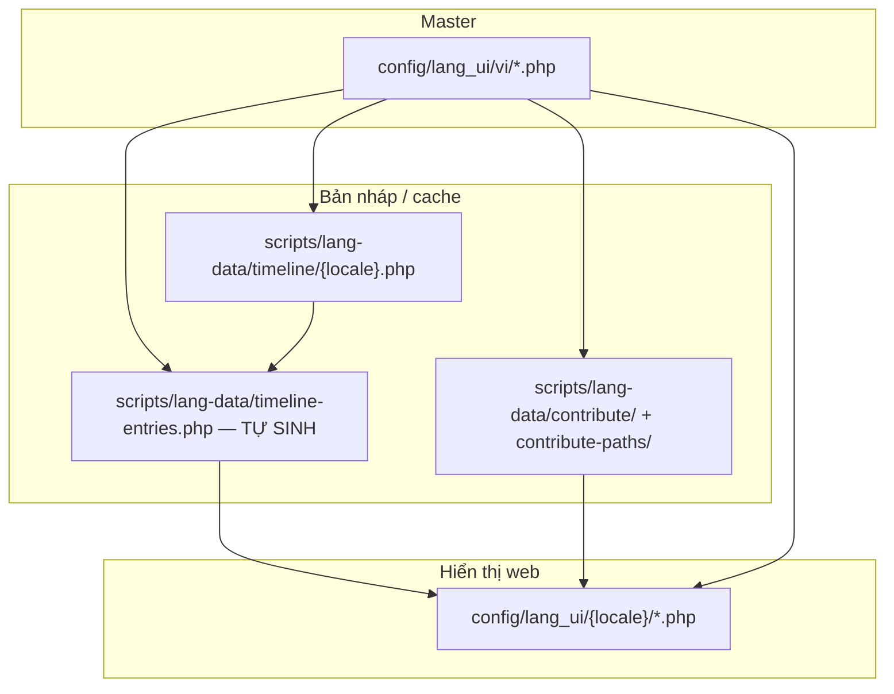

# Hướng dẫn bản dịch & chạy lại pipeline — **đọc file này trước**

Tài liệu **duy nhất** cho: sửa chữ landing / Chung sức, **dịch qua admin** (`/he-thong/ngon-ngu`, Chung sức), script **publish/sync** (không còn CLI Google Translate hàng loạt).

**Thư mục dự án (WSL):**

```bash
cd /var/www/html/hoangsa.dev
```

**Quy chuẩn dịch (tone, HTML, thuật ngữ):** [guide.md](./guide.md) · **Tên đảo:** [geo-names.json](./geo-names.json) + [geo-names.md](./geo-names.md) · **Tiến độ locale:** [status.md](./status.md)

---

## Dịch nội dung — admin (khuyên dùng)

| Trang | URL admin |
|-------|-----------|
| Landing (15 section) | `/he-thong/ngon-ngu/{locale}` |
| Chung sức | `/he-thong/ngon-ngu-chung-suc/{locale}` |

Trên header mỗi section: **Prompt** · **AI** (API) · **Google** (từng trường, gtx) · **Copy** (prompt ngoài) · **Nhập** (JSON). Sau khi sửa → **Lưu section**.

- Google trong admin: `app/Services/LangUiGoogleTranslateService.php` + `scripts/translation-text-utils.php` (chỉ gọi khi bấm nút, không script CLI).
- Cấu hình AI: `.env` (`AI_ENABLED`, `AI_OPENAI_API_KEY`, …).

**Đã gỡ** (tránh chạy nhầm dịch lại toàn site): `translate.php`, `translate-section.php`, `translate-landing-from-vi.php`, `translate-donor-payment-locales.php`, `run-translate-landing-chunks.sh`, …

## Lệnh publish / sync (WSL — không dịch Google)

```bash
cd /var/www/html/hoangsa.dev
```

| Mục đích | Lệnh |
|----------|------|
| Publish landing sau khi sửa `lang-data` / timeline | `php scripts/rebuild-landing-locales.php` |
| Ghi `chung_suc.php` từ lang-data | `php scripts/rebuild-contribute-locales.php` |

### A. Chỉ cập nhật tên đảo (không dịch lại)

```bash
php scripts/apply-geo-names-lang-ui.php
php scripts/sync-landing-lang-ui.php
php scripts/sync-footer-lang-ui.php
php scripts/patch-meta-from-footer.php
php scripts/patch-hero-title-country.php
php scripts/rebuild-timeline-locales.php
php scripts/patch-beauty-gallery-locales.php
```

Chi tiết: [geo-names.md § Lệnh chạy](./geo-names.md#lệnh-chạy-copy-một-lượt--wsl).

### B. Sửa khoảng trắng HTML (không gọi Google)

```bash
php scripts/repair-lang-ui-spacing.php
```

---

## 1. Sửa chữ — sửa ở đâu? (bảng tra nhanh)

| Bạn muốn đổi | Sửa file (ưu tiên) | Hiển thị trên web từ | Sau khi sửa, chạy |
|--------------|-------------------|----------------------|-------------------|
| **Caption / title / nội dung mục timeline** (vd. `tl_e3_caption`) | ① `config/lang_ui/vi/timeline.php` (master)<br>② `scripts/lang-data/timeline/{locale}.php` (bản dịch) | `config/lang_ui/{locale}/timeline.php` qua `t('tl_e3_caption')` | [Mục 4 — Timeline](#4-timeline-bắt-buộc-đúng-thứ-tự) |
| Tiêu đề / intro / nhãn mốc timeline (`timeline_title`, `tl_span_*`) | `config/lang_ui/vi/timeline.php` + `scripts/lang-data/timeline/{locale}.php`<br>*(header/span còn lấy từ `timeline-header.php`, `timeline-span-labels.php` khi generate)* | `config/lang_ui/{locale}/timeline.php` | Mục 4 |
| Nav, hero, mapview, evidence, beauty, history, action | `config/lang_ui/vi/{file}.php` → dịch sang `config/lang_ui/{locale}/{file}.php` | `config/lang_ui/{locale}/` | `validate-lang-ui.php` · [Mục 6](#6-landing-14-bundle-không-footer) |
| **Hiện trạng, pháp quyết, FAQ, nguồn, tưởng niệm** (box mới) | `config/lang_ui/vi/situation.php`, … | `t('situation_*')`, … | Admin `/he-thong/ngon-ngu/{locale}` hoặc sửa tay `config/lang_ui/{locale}/` |
| **Hero — tên quốc gia** (một chuỗi, gradient CSS) | `hero_title_country` trong `vi/hero.php` · **không** tách `hero_title_vn` / `hero_title_nam` | `t('hero_title_country')` | `patch-hero-title-country.php` (lấy `vietnam` từ geo-names.json) |
| **Đổi tên đảo / Việt Nam** trong bản dịch đã có (không MT lại) | `docs/translation/geo-names.json` | `config/lang_ui/{locale}/` + `scripts/lang-data/` | [geo-names.md](./geo-names.md) → `apply-geo-names-lang-ui.php` |
| **Tiêu đề / tag ảnh gallery (#beauty)** (`beauty_b01_title` …) | ① `config/landing.php` → `beauty_gallery.items[]`<br>② `php scripts/sync-landing-vi-from-config.php`<br>③ `scripts/lang-data/beauty-gallery-items.php` + `patch-beauty-gallery-locales.php` | `config/lang_ui/{locale}/beauty.php` qua `t('beauty_{id}_title')` | [Mục 6.1 — Beauty gallery](#61-beauty-gallery-tiêu-đề-ảnh) |
| **Trang Chung sức** (thư, lối đóng góp) | `config/lang_ui/vi/chung_suc.php` → `scripts/lang-data/contribute/{locale}.php` + `contribute-paths/{locale}.php` | `config/lang_ui/{locale}/chung_suc.php` | [Mục 5 — Chung sức](#5-chung-sức) |
| **Donor + PayPal** (intro, modal, toast, form) | `config/lang_ui/vi/chung_suc.php` (`cs_donor_*`, `cs_pay_paypal_*`) → [mục 5.1](#51-donor--paypal-panel-thanh-toán) | `config/lang_ui/{locale}/chung_suc.php` (cùng file thư/paths) | Mục 5.1 |
| **Footer** | `scripts/lang-data/footer-copy.php` → `sync-footer-lang-ui` (pipeline riêng) | `config/lang_ui/{locale}/footer.php` | **Không** nằm trong lô landing bên dưới |
| Chỉ **ảnh / vị trí** mục timeline | `config/landing.php` → `timeline_entries[]` (`img`, `pos`, `pivotal`…) | Blade + config ảnh | `clean-landing-timeline-config.php` — **không** khi chỉ đổi chữ |

### Caption timeline — ví dụ cụ thể

**Master (tiếng Việt):**

```php
// config/lang_ui/vi/timeline.php
'tl_e3_caption' => 'Đài tưởng niệm Đội Hoàng Sa · Đội Bắc Hải · lưu giữ ở Lý Sơn (Quảng Ngãi)',
```

**Không dùng để render:** `config/landing.php` → `timeline_entries[2]['caption']` — chỉ để **đối chiếu / ghi chú nội bộ**; nếu sửa ở đây mà không chạy pipeline timeline, trang vẫn hiện chữ cũ.

**Bản dịch từng locale (trước khi rebuild):**

```php
// scripts/lang-data/timeline/pl.php
'tl_e3_caption' => '...',
```

**File trình duyệt đọc (sau rebuild):**

```php
// config/lang_ui/pl/timeline.php  ← kiểm tra bằng grep key này
'tl_e3_caption' => '...',
```

---

## 2. Nguồn sự thật & luồng file



| File | Vai trò |
|------|---------|
| `config/lang_ui/vi/` | **Master** — mọi key, mọi ý nghĩa gốc |
| `config/lang_ui/{locale}/` | Bản **hiển thị** — Laravel `t('key')` |
| `scripts/lang-data/timeline/{locale}.php` | Chỉ key `tl_e1_*` … `tl_e11_*` (era, title, html, tag, caption) — đồng bộ 11 mục với `config/landing.php` |
| `scripts/lang-data/timeline-entries.php` | Gộp 49 locale — **không sửa tay lâu dài** |
| `scripts/lang-data/timeline-header.php` | `timeline_title`, `timeline_intro`, `tl_span_1_year` theo locale |
| `scripts/lang-data/timeline-span-labels.php` | `timeline_label`, `tl_span_*` còn lại |
| `scripts/lang-data/donor-payment-translations.php` | Donor modal + PayPal — ~49 locale (không `vi`) |
| `docs/translation/geo-names.json` | Tên Hoàng Sa / Trường Sa theo locale |

**Locale `vi`:** sau `rebuild-timeline-locales.php` **luôn** giữ nguyên `config/lang_ui/vi/timeline.php` (không bị cache ghi đè).

---

## 3. Dịch landing / Chung sức — quy trình hiện tại

1. Sửa master: `config/lang_ui/vi/*.php` (và `lang-data` nếu dùng pipeline timeline / contribute).
2. Mở admin → chọn locale → dịch từng section (AI / Google / Copy+Nhập).
3. **Lưu section** (ghi `config/lang_ui/{locale}/`).
4. Khi cần đồng bộ timeline / beauty / publish hàng loạt từ `lang-data` đã có sẵn:

```bash
php scripts/rebuild-landing-locales.php
php scripts/rebuild-contribute-locales.php
php artisan config:clear
```

Danh sách locale landing: `scripts/landing-locales.php` · [batch-locales.md](./batch-locales.md).

Sau khi đủ file box mới: xóa `PENDING_TRANSLATION_FILES` trong `app/Support/LangUi.php`.

| Công cụ | File |
|---------|------|
| Google (admin only) | `scripts/translation-text-utils.php` |
| Sửa khoảng trắng HTML | `scripts/repair-lang-ui-spacing.php` |
| Publish landing | `scripts/rebuild-landing-locales.php` |

---

## 4. Timeline — bắt buộc đúng thứ tự

Dùng sau **mọi** thay đổi chữ timeline (caption, title, html, …).

```bash
php scripts/generate-timeline-entries.php
php scripts/rebuild-timeline-locales.php
```

### Chỉ đổi UI timeline (intro, 4 mốc, footnote — không `tl_e*`)

Sửa `config/lang_ui/vi/timeline.php`, dịch qua admin **section timeline** (hoặc sửa tay `config/lang_ui/{locale}/timeline.php`), rồi generate + rebuild như trên.

### Sửa `tl_e*_html` bị token HTML lỗi (`HTML`, `HSXHTML`, …)

Sửa tay `config/lang_ui/{locale}/timeline.php` hoặc admin section **timeline**, sau đó:

```bash
grep -E '|ХТМЛ|HSXHTML' config/lang_ui/sr/timeline.php || echo "OK"
```

### Chỉ đổi caption một mục (vd. `tl_e3_caption`)

Sửa `vi` + `scripts/lang-data/timeline/{locale}.php` (hoặc admin), rồi:

```bash
php scripts/generate-timeline-entries.php
php scripts/rebuild-timeline-locales.php
```

### Một locale, một key (vd. `en`, `pl`)

1. Sửa `config/lang_ui/vi/timeline.php`
2. Sửa `scripts/lang-data/timeline/{locale}.php`
3. Hai lệnh generate + rebuild ở trên
4. (Tuỳ chọn) `config/landing.php` → `timeline_entries[N].caption` cho tài liệu nội bộ
5. `php scripts/validate-lang-ui.php {locale}`

### Kiểm tra caption trên disk

```bash
grep tl_e3_caption config/lang_ui/vi/timeline.php
grep tl_e3_caption config/lang_ui/pl/timeline.php
```

---

## 5. Chung sức

| Bước | File |
|------|------|
| Master | `config/lang_ui/vi/chung_suc.php` |
| Nháp dịch | `scripts/lang-data/contribute/{locale}.php` (thư)<br>`scripts/lang-data/contribute-paths/{locale}.php` (lối đóng góp) |
| Hiển thị | `config/lang_ui/{locale}/chung_suc.php` |

Dịch nội dung: admin `/he-thong/ngon-ngu-chung-suc/{locale}` (AI / Google / Copy+Nhập). Publish thư + lối đóng góp từ lang-data:

```bash
php scripts/rebuild-contribute-locales.php
```

**Lưu ý:** `rebuild-contribute-locales.php` chỉ ghi **thư + lối đóng góp** từ `lang-data/contribute/` và `contribute-paths/`. Key **donor / PayPal** nằm trực tiếp trong `chung_suc.php` — dùng pipeline [mục 5.1](#51-donor--paypal-panel-thanh-toán), **không** bị rebuild-contribute ghi đè (trừ khi file thiếu key — khi đó chạy patch trước).

### 5.1 Donor + PayPal (panel thanh toán)

Dùng chung landing `#action` và trang Chung sức (`participation-fund.js`, modal drawer).

| | |
|--|--|
| **Master (vi)** | `config/lang_ui/vi/chung_suc.php` — prefix `cs_donor_*`, `cs_pay_paypal_*`, `cs_pay_bank_section` |
| **Hiển thị web** | `config/lang_ui/{locale}/chung_suc.php` — `ParticipationPaths::paymentLabels()` |
| **Bản dịch ~49 locale** | `scripts/lang-data/donor-payment-translations.php` |
| **HTML trong intro** | `cs_donor_lead` giữ nguyên `<span class="fund-donor-intro__hl">…</span>` khi dịch |
| **Placeholder PayPal** | `cs_pay_paypal_amount_invalid` giữ `:min` và `:max` |

**Key chính (không đủ liệt kê hết):** `cs_donor_eyebrow`, `cs_donor_title`, `cs_donor_lead`, `cs_donor_intro_cta`, `cs_donor_modal_*`, `cs_donor_toast_*`, `cs_donor_name|phone|email|note_*`, `cs_donor_privacy`, `cs_pay_paypal_*`, `cs_pay_bank_section`.

#### Khi chỉ sửa copy tiếng Việt

1. Sửa `config/lang_ui/vi/chung_suc.php`
2. Dịch lại mọi locale (chọn **một** cách bên dưới)
3. `php artisan config:clear` (không `config:cache` trên prod theo `docs/DEPLOY.md`)

#### Cách A — Áp bản dịch có sẵn (khuyên dùng, nhanh)

Sau khi cập nhật `scripts/lang-data/donor-payment-translations.php` (sửa tay hoặc regenerate):

```bash
php scripts/apply-donor-payment-translations.php
# một vài locale:
php scripts/apply-donor-payment-translations.php en fr de ja
```

#### Cách B — Admin (Google / AI từng trường)

Mở `/he-thong/ngon-ngu-chung-suc/{locale}` → section **chung_suc** → nút **Google** hoặc **AI** trên các key `cs_donor_*` / `cs_pay_*`.

#### Cách C — Chỉ đồng bộ key vi (placeholder, chưa dịch)

Dùng khi mới thêm key vào master — gắn chữ vi tạm cho mọi locale:

```bash
php scripts/patch-contribute-payment-locales.php
```

Sau đó chạy **Cách A** hoặc **B** để thay bằng bản dịch thật.

#### Thứ tự khuyến nghị (đổi donor/PayPal toàn site)

```bash
# 1) Sửa config/lang_ui/vi/chung_suc.php
# 2) Dịch locale: admin Chung sức HOẶC:
php scripts/apply-donor-payment-translations.php
php scripts/rebuild-contribute-locales.php
```

**Không** cần `npm run build` chỉ vì đổi chữ PHP (trừ khi đổi JS). Hard refresh trình duyệt sau `config:clear`.

---

## 6. Landing (14 bundle, không footer)

**File trong `config/lang_ui/{locale}/`** — danh sách đầy đủ: `scripts/landing-lang-files.php` → `landingLangUiBundles()`:

`nav.php`, `meta.php`, `hero.php`, `mapview.php`, `timeline.php`, `evidence.php`, `beauty.php`, `history.php`, `action.php`, **`situation.php`**, **`rulings.php`**, **`faq.php`**, **`sources.php`**, **`memorial.php`**

**Không** gồm: `footer.php` (pipeline footer riêng).

**Sau khi dịch xong toàn bộ:** xóa hết mục trong `App\Support\LangUi::PENDING_TRANSLATION_FILES` (5 file box mới) để `validate-lang-ui` và `hasLocale()` đếm đủ key.

### Sửa tay từng locale

1. Đối chiếu `config/lang_ui/vi/{file}.php`
2. Tra [geo-names.json](./geo-names.json) cho `{locale}`
3. Ghi `config/lang_ui/{locale}/{file}.php`
4. `php scripts/validate-lang-ui.php {locale}`

### Đồng bộ tên đảo sau khi đã có bản dịch

**Bước 1 — thay chuỗi cũ trong file đã dịch** (timeline, chung sức, mọi key trong `lang_ui`):

```bash
php scripts/apply-geo-names-lang-ui.php
php scripts/apply-geo-names-lang-ui.php it          # ví dụ: Isole Paracelso → Isole Paracel
php scripts/apply-geo-names-lang-ui.php en fr it
```

**Footer** (logo/quote — từ `footer-copy.php`, không qua `apply-geo-names`):

```bash
php scripts/sync-footer-lang-ui.php
php scripts/sync-footer-lang-ui.php it
```

**Bước 2 — landing** (hero line1, meta, mapview; 9 file, trừ footer):

```bash
php scripts/sync-landing-lang-ui.php
php scripts/sync-landing-lang-ui.php it pl nl
```

Chi tiết thứ tự đầy đủ: [geo-names.md § Cập nhật map](./geo-names.md#cập-nhật-map). **Không** thay thế dịch full từ `vi` nếu chỉ đổi tên trong JSON.

### 6.1 Beauty gallery (tiêu đề ảnh)

| | |
|--|--|
| **Master tiếng Việt** | `config/landing.php` → `beauty_gallery.items[]` (`id`, `title`, `tag`) |
| **Hiển thị web** | `config/lang_ui/{locale}/beauty.php` — `t('beauty_{id}_title')`, `t('beauty_{id}_tag')` |
| **Bản dịch ~49 locale** | `scripts/lang-data/beauty-gallery-items.php` (mẫu `%hs` / `%ts` / `%sea` → [geo-names.json](./geo-names.json)) |
| **Script ghi ra disk** | `php scripts/patch-beauty-gallery-locales.php` |

`BeautyGallery` ưu tiên `lang_ui`; nếu thiếu key mới fallback sang `title`/`tag` trong `landing.php`. Sau khi sync `vi`, luôn patch locale để tránh tiêu đề cũ (vd. “Bình minh trên Biển Đông”) che master mới.

**Khi đổi caption trong `landing.php`:**

```bash
php scripts/sync-landing-vi-from-config.php
php scripts/patch-beauty-gallery-locales.php
# một vài locale: php scripts/patch-beauty-gallery-locales.php en fr
```

Dịch câu mới (không chỉ tên đảo): admin section **beauty** hoặc cập nhật `scripts/lang-data/beauty-gallery-items.php` rồi patch lại.

- Tra tên đảo: [geo-names.md](./geo-names.md) · [geo-names.json](./geo-names.json) — **không** tự dịch `Hoang Sa` trong bản `en` khi map đã ghi `Paracel Islands`.

`rebuild-landing-locales.php` gọi `patch-beauty-gallery-locales.php` sau bước sync `vi` / geo-names (không MT CLI).

---

## 7. Bảng script PHP (đầy đủ)

| Script | Mục đích |
|--------|----------|
| **`validate-lang-ui.php`** | So key với `vi`; `[OK]` / `[FAIL]` |
| **`generate-timeline-entries.php`** | Build `timeline-entries.php` từ `vi` + `lang-data/timeline/` + header/span (11 mục) |
| **`prune-timeline-locales.php`** | Xóa `tl_e12_*`, `tl_e13_*`, key cũ `timeline_footnote` / `timeline_bridge_*`; căn key theo `vi/timeline.php` |
| **`rebuild-timeline-locales.php`** | Ghi `config/lang_ui/*/timeline.php` (giữ `vi` từ master; 11 mục) |
| **`rebuild-contribute-locales.php`** | Ghi `chung_suc.php` từ lang-data contribute (thư + paths; **không** donor/PayPal) |
| **`patch-contribute-payment-locales.php`** | Gộp key `cs_donor_*` + `cs_pay_*` từ **vi** vào mọi `chung_suc.php` (placeholder) |
| **`apply-donor-payment-translations.php`** | Gộp donor/PayPal từ `lang-data/donor-payment-translations.php` |
| **`landing-locales.php`** | Danh sách 49 locale (nguồn duy nhất) |
| **`translation-text-utils.php`** | Google gtx — chỉ qua admin (`LangUiGoogleTranslateService`) |
| **`rebuild-landing-locales.php`** | Publish landing (sync vi, geo, beauty, timeline, validate) |
| `rebuild-batch2-*` | Legacy batch (deprecated) |
| **`sync-landing-vi-from-config.php`** | `landing.php` → `config/lang_ui/vi/` (timeline, evidence, **beauty gallery**, action, meta) |
| **`patch-beauty-gallery-locales.php`** | Ghi `beauty_b01…b08` từ `beauty-gallery-items.php` + geo-names (không MT) |
| **`patch-hero-title-country.php`** | Gộp hero `hero_title_country` từ `geo-names.json` → `vietnam` (xóa `hero_title_vn` / `hero_title_nam`) |
| **`apply-geo-names-lang-ui.php`** | Thay tên đảo / Việt Nam theo `geo-names.json` trên `lang_ui` + `lang-data` (không MT) |
| **`sync-landing-lang-ui.php`** | Tên đảo trên 9 file landing (hero/meta/mapview overrides) |
| **`patch-meta-from-footer.php`** | Meta OG từ footer-copy |
| **`scaffold-lang-ui.php`** | Khung 10 file mới từ `vi` (TODO) |
| **`generate-lang-ui-batch.php`** | Ghi `lang_ui` từ `scripts/lang-data/{locale}.php` bundle |
| **`run-all-timeline-tasks.php`** | Test pipeline timeline + validate en/zh-cn |
| `clean-landing-timeline-config.php` | Chỉ metadata ảnh `landing.php` — **không** khi đổi chữ |
| `build-timeline-lang-data.php` | Tạo lại toàn bộ timeline lang-data từ template — dễ ghi đè |

Cache MT CLI đã bỏ; admin Google không dùng cache file trên disk.

---

## 8. Vì sao caption bị “reset” về bản cũ?

| Nguyên nhân | Cách tránh |
|-------------|------------|
| Chỉ sửa `landing.php` | Sửa `vi/timeline.php` + chạy generate → rebuild |
| Chỉ chạy `rebuild-timeline-locales.php` | Chạy **`generate-timeline-entries.php` trước** |
| `timeline-entries.php` còn cache cũ | Regenerate sau khi sửa `vi` hoặc `lang-data/timeline/` |
| Chạy `clean-landing-timeline-config.php` khi chỉ đổi chữ | Không dùng script đó cho caption |
| Chỉ sửa `landing.php` → `beauty_gallery` | `sync-landing-vi-from-config.php` → `patch-beauty-gallery-locales.php` — **không** MT `beauty.php` |
| Chỉ chạy `rebuild-landing-locales.php` mà chưa patch gallery | Sau sync `vi`, chạy `patch-beauty-gallery-locales.php` nếu đổi `beauty-gallery-items.php` |

---

## 9. Checklist — đổi nội dung timeline (caption / mục 3)

- [ ] Sửa `config/lang_ui/vi/timeline.php` (Unicode chuẩn: Đài, Lý Sơn)
- [ ] Sửa `scripts/lang-data/timeline/{locale}.php` cho từng ngôn ngữ cần hiển thị
- [ ] `php scripts/generate-timeline-entries.php`
- [ ] `php scripts/rebuild-timeline-locales.php`
- [ ] `grep tl_e3_caption config/lang_ui/{locale}/timeline.php`
- [ ] Mở `/{locale}` trên trình duyệt — mục timeline tương ứng
- [ ] `php scripts/validate-lang-ui.php vi` và locale vừa sửa

### 9.1 Checklist — tiêu đề ảnh beauty gallery

- [ ] Sửa `title` / `tag` trong `config/landing.php` → `beauty_gallery.items[]` (Unicode chuẩn)
- [ ] `php scripts/sync-landing-vi-from-config.php`
- [ ] (Nếu đổi ý nghĩa câu) cập nhật `scripts/lang-data/beauty-gallery-items.php` theo [geo-names.json](./geo-names.json)
- [ ] `php scripts/patch-beauty-gallery-locales.php`
- [ ] `grep beauty_b01_title config/lang_ui/en/beauty.php` — phải khớp nghĩa master, dùng tên đảo đúng locale
- [ ] `php scripts/validate-lang-ui.php vi` (và locale vừa patch nếu chỉ chạy một phần)

---

## 10. Tài liệu khác (không trùng nội dung pipeline)

| File | Dùng khi |
|------|----------|
| [guide.md](./guide.md) | Quy chuẩn dịch, tone, HTML |
| [glossary.md](./glossary.md) | Thuật ngữ (Biển Đông, …) |
| [geo-names.md](./geo-names.md) | Cách dùng map tên đảo |
| [ai-prompt.md](./ai-prompt.md) | Prompt AI dịch 10 file |
| [batch-locales.md](./batch-locales.md) | Bảng 49 locale landing |
| [status.md](./status.md) | Tiến độ từng locale |

**Đã gộp vào file này (không cần mở):** `scripts-and-rebuild.md` — chỉ còn link redirect.

---

## 11. Cheat sheet một dòng

```bash
# Dịch nội dung: /he-thong/ngon-ngu/{locale} · /he-thong/ngon-ngu-chung-suc/{locale}

# Publish landing / contribute sau khi sửa lang-data:
php scripts/rebuild-landing-locales.php
php scripts/rebuild-contribute-locales.php

# Beauty caption từ landing.php:
php scripts/sync-landing-vi-from-config.php && php scripts/patch-beauty-gallery-locales.php

# Chỉ tên đảo (không dịch lại):
php scripts/apply-geo-names-lang-ui.php

# Kiểm tra:
php scripts/validate-lang-ui.php pl
```
